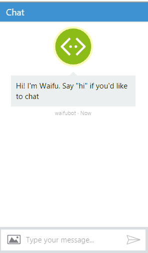
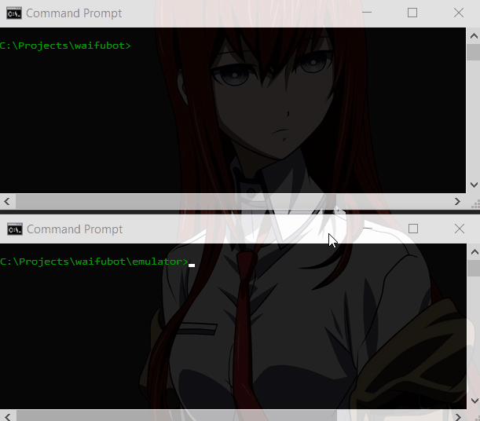

# waifubot

A javascript bot for **Anime Lovers**, built using [Microsoft Bot Framework](https://github.com/Microsoft/BotBuilder) and processing natural language with [LUIS](https://www.luis.ai/).

> I always dreamed of having a waifu written in JavaScript. So I made it myself.

<p align="center">
  
</p>

> Otakus gonna love it!

## Features

* Commands in natural language (just English now)
* TODO: Alerts
* TODO: Plugins in Pure JavaScript
* Actually, looking for suggestions...

## Usage

You can try the last released build by running [./index.html](https://rawgit.com/jieverson/waifubot/master/index.html):

>**Note:** Waifu implements `continuous deployment` to Azure.

In the future, the bot is going to be available to:
* cmd/terminal
* Twitter
* Slack
* Skype
* Email
* SMS
* Probably other stuff...

## Install/Run from Source

Create a new app at [LUIS](https://www.luis.ai/) importing our provided [luis_model.json](./luis_model.json).

```shell
# Clone this repo
git clone https://github.com/jieverson/waifubot.git
# Go into the repo
cd waifubot
# Install dependencies
npm install
# Set environment variables
set LUIS_APP_ID=YOUR_LUIS_APP_ID
set LUIS_SUBSCRIPTION_KEY=YOUR_LUIS_SUBSCRIPTION_KEY
# Run server at localhost
node app.js
# Run BFEmulator
cd emulator & BFEmulator.exe
# Open emulator settings
/settings
# Set current endpoint to:
http://localhost:3978/api/bot
# Say Hi, and have some fun :)
```

<p align="center">
  
</p>

>**Note:** You can create your app at [Bot Framework](https://dev.botframework.com/) if you want to set `BOT_APP_ID` and `BOT_APP_SECRET`.

## Running emulator on Mac/Linux

Folks who are developing on Mac and Linux should know that the BFEmulator works using `mono`.

To install

* Install [Mono](http://www.mono-project.com/download/#download-mac)
* mono BFEmulator.exe

## Running Tests

This project uses [grunt](http://gruntjs.com/) for running `jshint` and `nodeunit`.

```shell
# Make sure you have grunt-cli installed globally
npm install -g grunt-cli
# Grunt default task is going to execute jshint and nodeunit
grunt
```

>**TODO:** [app.js](./app.js) need to be testable.

## How to make Plugins

>**TODO:** We don't have anything done yet, so come back later.

## License

[The MIT License (MIT)](./LICENSE)