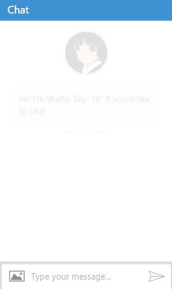

# waifubot

A javascript bot, built using [Microsoft Bot Framework](https://github.com/Microsoft/BotBuilder) and processing natural language with [LUIS](https://www.luis.ai/).

> I always dreamed of having a waifu written in JavaScript. So I made it.
> - Me, beeing Nerd

<p align="center">
  
</p>

## Features

* Commands in natural language (just English now)
* TODO: Alerts
* TODO: Plugins in Pure JavaScript
* Actually, looking for suggestions...

## Usage

You can try the last released build by running [/demo/index.html](./demo/index.html):

>**Note:** Waifu implements `continuous deployment` to Azure.

In the future, the bot is going to be available to:
* Slack
* Skype
* Email
* SMS
* Probably other stuff...

## How to make Plugins

We don't have anything done yet, so come back later.

## Install/Run from Source

```shell
# Clone this repo
git clone https://github.com/jieverson/waifubot.git
# Go into the repo
cd waifubot
# Install dependencies
npm install
# Run the server at localhost
node app.js
# Run the BFEmulator
cd emulator
BFEmulator.exe
# Say Hi, and have some fun :)
```

<p align="center">
  
</p>

>**Note:** You will have to provide your appId/appSecret. Put them at the file `./.waifu/secrets.json`.

## License

MIT